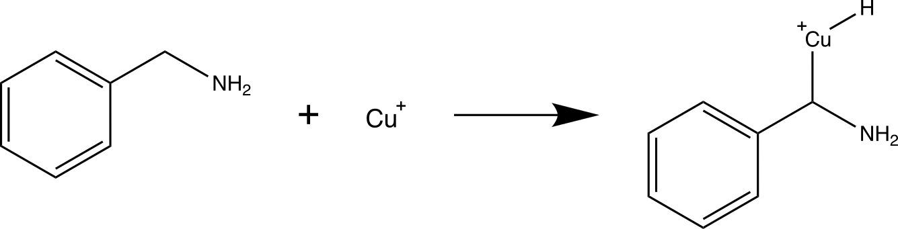
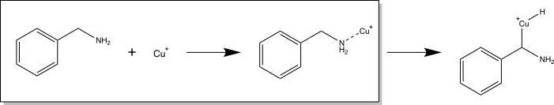
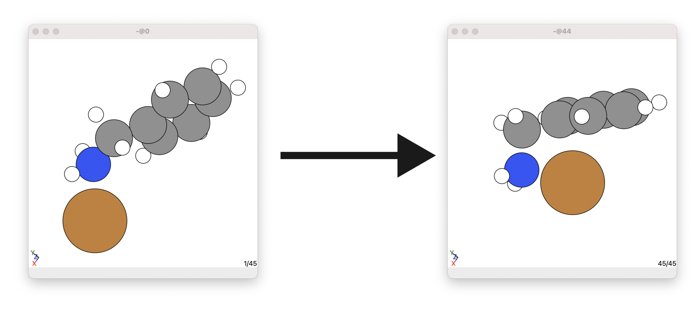
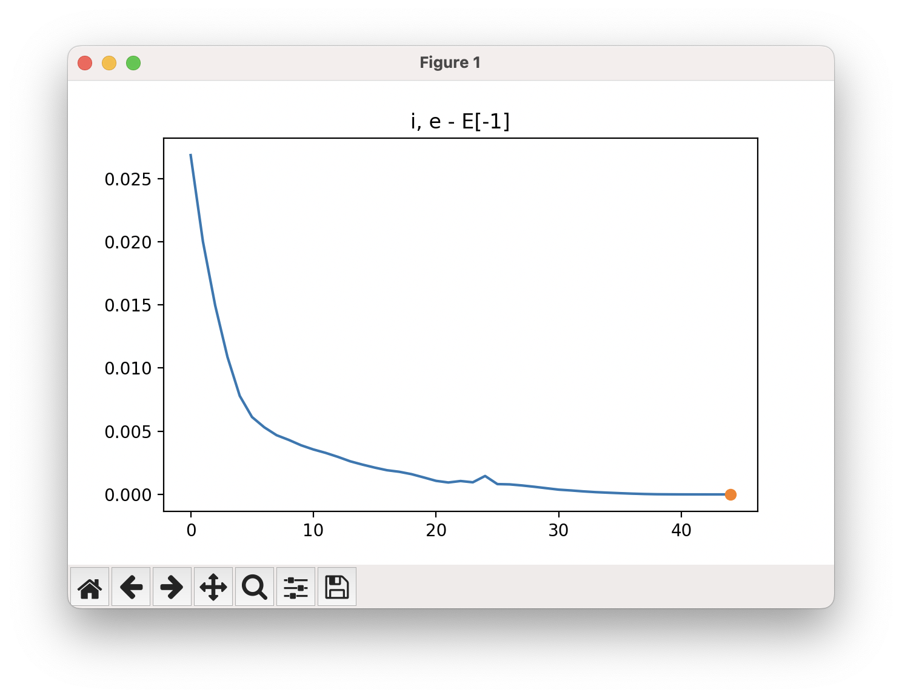

# Checking the Energy for Coalescing Reactants

Consider the mechanistic step below:

<p align="center">
    
</p>

Here, we want to determine the transition state for a Cu inserting itself into the C-H bond of the alpha bond in benzylamine. However, as we need to allow the reactants to coalesce in this mechanistic step, it is usually better to split this mechanistic step into two steps:

1. Reactants coalesce such that the Cu metal coordinates to the benzylamine
2. Cu inserts into the C-H bond. 



In this article, we will look at how to determine the energy released for the reactants to coalesce together. Here, this means the energy released when the Cu atom coordinates to the benzylamine. 


## Questions and Feedback

I am very keen for feedback about how you find the information in this github page, both the process and the clarity of what I have written. If you have any questions about this process, feed free to write me a message. 

To do this, click on the ``Issues`` tag at the top of this Github page, click the ``New issue`` button, and write you question/give you feedback. 

Thanks!


## ORCA

I have written this procedure for: 

* ORCA 5.0.3
* ORCA 5.0.4

This method should be valid for future versions of ORCA, but just in case any problems occur it may be due to ORCA version issues. 


## Before beginning

Read the **Before beginning** section of https://github.com/geoffreyweal/ORCA_Mechanism_Procedure

# Coalescing Reactants

## Pre-calculation step:

Before beginning, you need to decide what universal setting you want to use for your mecahnisms. This includes the basis set, functional, solvent model, etc. For example: 

```
!B3LYP DEF2-TZVP D3BJ
%CPCM EPSILON 6.02 REFRAC 1.3723 END
```

Other options that are good to include in all your orca input files are:

```
%SCF
    MaxIter 2000       # Here setting MaxIter to a very high number. Intended for systems that require sometimes 1000 iterations before converging (very rare).
    DIISMaxEq 5        # Default value is 5. A value of 15-40 necessary for difficult systems.
    directresetfreq 15 # Default value is 15. A value of 1 (very expensive) is sometimes required. A value between 1 and 15 may be more cost-effective.
END
%PAL NPROCS 32 END # The number of CPUs you want ORCA to use
%maxcore 2000 # This indicates you want ORCA to use only 2GB per core maximum, so ORCA will use only 2GB*32=64GB of memory in total.
```

**RECOMMENDATIONS**: With regards to the functional, basis set, solvent model, etc., it is recommended that you discuss what you are wanting to do with a computational chemist (if you are not a computational chemist) to get advice about how to set up these, as well as how to proceed with your project. This is important because you want to keep these as consistent as possible across all your mechanistic steps you perform. I would personally recommend reading other computation papers related to the system you are looking at understanding, as well as reading the following papers to understand what functional and basis set is most appropriate for your project:
* https://onlinelibrary.wiley.com/doi/epdf/10.1002/anie.202205735 (This paper is VERY recommended to non-computational chemists and computational chemist. It is a very good guide at all the considerations you should make and best Practices)
* https://pubs.rsc.org/en/content/articlelanding/2017/cp/c7cp04913g (The results section (particularly the end of the results section) provides a list of good functionals to use based on scientific validations)
* https://bpb-ap-se2.wpmucdn.com/blogs.unimelb.edu.au/dist/0/196/files/2021/05/GOERIGK_GroundStateDFT_RACI2021_handout.pdf (Slides from Larz Goerik based on the paper above)
* https://www.publish.csiro.au/CH/CH20093 (This paper give an idea of what you need to think about for excited state calculations)

## Step 1: Locally optimise the co-ordinated/coalesced system

First we need to locally optimize the co-ordinated/coalesced system (following step 1 of the ORCA Mechanism Procedure)[https://github.com/geoffreyweal/ORCA_Mechanism_Procedure?tab=readme-ov-file#step-1-locally-optimize-reactant-and-product]. 
* In this example, the co-ordinated/coalesced system is called the ``Product``. (The ``Product`` here is the ``Reactant`` from the [ORCA Mechanism Procedure example](https://github.com/geoffreyweal/ORCA_Mechanism_Procedure))


To do this, make a ``Product`` folder and add to each folder the ``.inp`` file for performing local optimisations. Make sure you include the following into your ``.inp`` files for both the reactant and product:

```
!OPT FREQ TightOPT TightSCF defgrid2
```

Here, we perform a geometry optimization to optimize the system. The tags here indicate you want to do the following: 

* ``OPT``: Indicates you want ORCA to perform a local optimisation. 
* ``FREQ``: Indicates you want ORCA to calculation the vibrational frequency for your molecule. This is used to verify that your optimised structure is indeed a local minimum. This will also give you the Gibbs free energy for your molecule that you (may) want to report as your energy. 
* ``TightOPT``: Tells ORCA to tighten the convergence criteria for each geometric step. See ORCA 5.0.4 Manual, page 20 for more info.
* ``TightSCF``: Tells ORCA to tighten the convergence criteria for each electronic step. 
* ``defgrid2``: Indicates how fine we want the intergration grid to be (This is the default).

**NOTE 1**: I have set the electronic optimisation steps to be tight (``TightSCF``). This is just to make sure the electronic are well converged, but it may be overdo. If you have problems, you can try using the normal convergence criteria for the electronic steps (``NormalSCF``)

**NOTE 2**: [Click here](https://sites.google.com/site/orcainputlibrary/numerical-precision?authuser=0) for more information about other electronic convergence and interaction grid settings.

An example of the complete ``orca.inp`` file for a local optimisation ORCA job is as follows (from ``Examples/Step1_Geo_Opt/Products/orca.inp``): 

```orca.inp
!B3LYP DEF2-TZVP D3BJ 
!OPT FREQ TightOPT TightSCF defgrid2
%SCF
    MaxIter 2000       # Here setting MaxIter to a very high number. Intended for systems that require sometimes 1000 iterations before converging (very rare).
    DIISMaxEq 5        # Default value is 5. A value of 15-40 necessary for difficult systems.
    directresetfreq 15 # Default value is 15. A value of 1 (very expensive) is sometimes required. A value between 1 and 15 may be more cost-effective.
END
%CPCM EPSILON 6.02 REFRAC 1.3723 END
%PAL NPROCS 32 END
%maxcore 2000 # This indicates you want ORCA to use only 2GB per core maximum, so ORCA will use only 2GB*32=64GB of memory in total.
* xyzfile 1 1 product.xyz

```

**NOTE 3**: Make sure you include a newline or two at the end of your ``orca.inp`` file, otherwise ORCA will get confused and not run.

Here, ``xyzfile`` allows you to import an xyz file into ORCA. You can add the xyz data directly in the ``.inp`` file, but I find having a separate ``xyz`` file is better because this allow you to look at the xyz file in a gui like in atomic simulation environment (ASE --> https://wiki.fysik.dtu.dk/ase/ase/gui/basics.html and https://wiki.fysik.dtu.dk/ase/ase/gui/gui.html). Include the ``xyz`` files of your product molecule in the ``Product`` folders, respectively. If your reactants or product contain more than one molecule/chemical system, split them up and localise them individually in their own individual folders. 

Submit the job to slurm using the ``submit.sl`` file:

```bash
#!/bin/bash -e
#SBATCH --job-name=A_Coalesce_Step1_Product
#SBATCH --ntasks=32
#SBATCH --mem=68GB
#SBATCH --partition=large
#SBATCH --time=3-00:00     # Walltime
#SBATCH --output=slurm-%j.out      # %x and %j are replaced by job name and ID
#SBATCH --error=slurm-%j.err
#SBATCH --nodes=1 # OpenMPI can have problems with ORCA over multiple nodes sometimes, depending on your system.

# Load ORCA
module load GCC/9.2.0
module load ORCA/5.0.3-OpenMPI-4.1.1

# ORCA under MPI requires that it be called via its full absolute path
orca_exe=$(which orca)

# Don't use "srun" as ORCA does that itself when launching its MPI process.
${orca_exe} orca.inp > output.out

```

**NOTE 4**: While ORCA has been told to use 2000 (MB) * 32 = 64 GB in the ``.inp`` file, we have told slurm to reserve ``72GB`` of memory. It is a good idea to give your ORCA job a few GBs of RAM extra in slurm just in case ORCA accidentally goes over it's allocated RAM. Here, I have abitrarily given this job 12GB more RAM just in case. 

### What to do if you have more than one reactant (or product)

Sometimes if you have more reactant (or product), you may also need to obtain the energy of the reactants (or products) when they are separated. Often you can just calculate these separately as their own ORCA calculations. However, for systems involving metals in particular, it is a good idea to check if there is a transition state for a metal coordinating to a ligand. There probably should not be a transition state, but is good to check. In this case, read the [ORCA Coalesce Reactants Procedure](https://github.com/geoffreyweal/ORCA_Coalesce_Reactants_Procedure) tutorial to understand how to check this. 


### Outputs from ORCA

When ORCA is running, it will output several files, including an ``output.out`` file, an ``orca.xyz`` file, and an ``orca_trj.xyz`` file.

* ``output.out``: This file contains the details about how ORCA ran. This includes the vibrational frequency data to check if the locally optimised structure is in fact a local minimum.
* ``orca.xyz``: This is the locally optimised molecule. 
* ``orca_trj.xyz``: This file shows how ORCA locally optimised the molecule. Type ``viewOPT`` into the terminal to view how the molecule was optimised, including an energy profile. 

Once ORCA has finished, you should do the following checks:

#### Check 1: Look at your molecule and the energy profile and make sure it looks ok

The first thing to do is to look at your molecule and check if it looks sensible with your chemical intuition. You can do this by opening up the ``orca.xyz`` in your favourite GUI. I like to use atomic simulation environment (ASE). To look at the molecule and its energy profile:

1. Open a new terminal
2. ``cd`` into the optimisation folder
3. Type ``viewOPT`` into the terminal

```bash
# cd into your optimisation folder
cd ORCA_Mechanism_Procedure/Examples/Step1_Geo_Opt/Products

# View the optimisation 
viewOPT
# or directly view the orca_trj file.
ase gui orca_trj.xyz
# or save the OPT_images.xyz file only and copy it back to your computer
# to view with ``ase gui OPT_images.xyz`` (if you are using a HPC).
viewOPT False
```

**NOTE 1**: If ``viewOPT`` does not work, type ``ase gui orca_trj.xyz`` into the terminal instead of ``viewOPT``. 

**NOTE 2**: ``viewOPT`` will also create a xyz file called ``OPT_images.xyz`` that you can copy to your computer if you are using a high-capacity computer (HPC) system and view on your own computer. 
* If you just want to create the ``OPT_images.xyz`` file, type into the terminal ``viewOPT False`` (which will create the ``OPT_images.xyz`` file). 

Here, you want to **check that the molecule looks ok from your chemical and physical intuition**. Here is an example of what the optimised molecule looks like (the ``orca.xyz`` file here). If we look at the initial molecule geometry (by typing ``ase gui product.xyz`` into the terminal), we can see how the molecule has changed after being geometrically optimised: 



``viewOPT`` will also show you the energy profile for this optimisation. 




#### Check 2: Did the geometry optimisation converge successfully

You want to look for a table in the ``output.out`` file for a table with the title ``Geometry convergence``. There will be many of these tables, as one is given for each geometric step performed. You want to look at the last ``Geometry convergence`` table as this will give the detailed for the lastest geometrically optimised step. An example for the ``Products`` is given below:

```
                                .--------------------.
          ----------------------|Geometry convergence|-------------------------
          Item                value                   Tolerance       Converged
          ---------------------------------------------------------------------
          Energy change      -0.0000006152            0.0000010000      YES
          RMS gradient        0.0000177282            0.0000300000      YES
          MAX gradient        0.0000821491            0.0001000000      YES
          RMS step            0.0004097121            0.0006000000      YES
          MAX step            0.0015679250            0.0010000000      NO
          ........................................................
          Max(Bonds)      0.0003      Max(Angles)    0.05
          Max(Dihed)        0.09      Max(Improp)    0.00
          ---------------------------------------------------------------------

       The energies and gradients are converged
       and the convergence on bond distances, angles, dihedrals and impropers
       is acceptable.
       Convergence will therefore be signaled now


                    ***********************HURRAY********************
                    ***        THE OPTIMIZATION HAS CONVERGED     ***
                    *************************************************
```

In this example, you can see that the majority of the items of interest have converged, and ORCA has happy that the convergence criteria have been met. ORCA also tells you this by giving you a ``HURRAY`` message as well as a ``THE OPTIMIZATION HAS CONVERGED`` message (as you can see in above). 

#### Check 3: Does the molecule have any non-negative vibrational frequencies

After performing a local optimization, it is important that you look at the vibrational frequencies that are calculated. These are the frequencies that you could see in an IR or Raman spectra. You want to look through your ``.out`` file for a heading called ``VIBRATIONAL FREQUENCIES``. **We want to make sure that all the frequencies are non-negative**. This means we are in a local energy well. If one or more frequency is negative, this means we are not in a local minimum. In this case, you need to tighten the optimization, or need to look at your molecule and see if any part of it structurally does not make sense with your chemical intuition. 

In the example below (for ``Products``), you can see that there are no non-negative frequencies from the ``FREQ`` calculation, therefore we are in a local energy well: 

```
-----------------------
VIBRATIONAL FREQUENCIES
-----------------------

Scaling factor for frequencies =  1.000000000  (already applied!)

   0:         0.00 cm**-1
   1:         0.00 cm**-1
   2:         0.00 cm**-1
   3:         0.00 cm**-1
   4:         0.00 cm**-1
   5:         0.00 cm**-1
   6:        52.20 cm**-1
   7:        71.30 cm**-1
   8:       146.78 cm**-1
   9:       226.53 cm**-1
  10:       282.60 cm**-1
  11:       302.99 cm**-1
  12:       392.29 cm**-1
  13:       402.58 cm**-1
  14:       414.78 cm**-1
  15:       473.15 cm**-1
  16:       495.75 cm**-1
  17:       585.93 cm**-1
  18:       628.71 cm**-1
  19:       678.81 cm**-1
  20:       709.76 cm**-1
  21:       778.78 cm**-1
  22:       797.94 cm**-1
  23:       810.91 cm**-1
  24:       844.28 cm**-1
  25:       953.22 cm**-1
  26:       978.70 cm**-1
  27:       996.50 cm**-1
  28:      1019.06 cm**-1
  29:      1030.63 cm**-1
  30:      1046.65 cm**-1
  31:      1102.99 cm**-1
  32:      1137.60 cm**-1
  33:      1187.17 cm**-1
  34:      1210.13 cm**-1
  35:      1237.46 cm**-1
  36:      1309.92 cm**-1
  37:      1358.89 cm**-1
  38:      1377.61 cm**-1
  39:      1480.76 cm**-1
  40:      1514.47 cm**-1
  41:      1543.18 cm**-1
  42:      1608.95 cm**-1
  43:      1633.11 cm**-1
  44:      1647.22 cm**-1
  45:      1845.64 cm**-1
  46:      3184.30 cm**-1
  47:      3186.78 cm**-1
  48:      3189.57 cm**-1
  49:      3192.88 cm**-1
  50:      3203.72 cm**-1
  51:      3209.16 cm**-1
  52:      3487.08 cm**-1
  53:      3585.59 cm**-1
```


